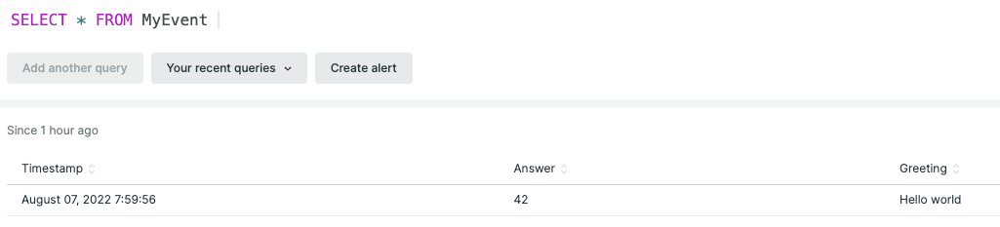
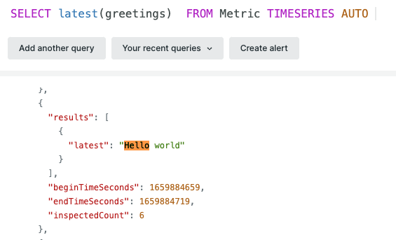
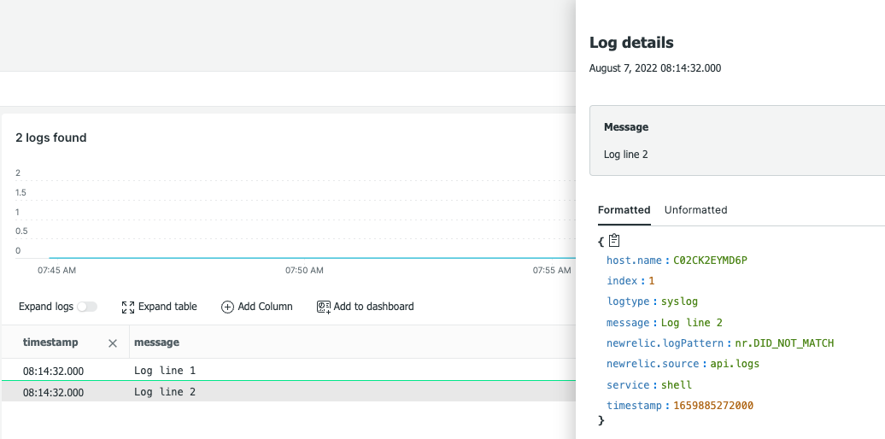

# nrapm - New Relic instrumentation for Unix (and not only) shells.

nrapm is a shell command, that sends metric events and logs to a [New Relic monitoring and observability platform](https://www.newrelic.com). In fact, this tool is your [APM instrument](https://newrelic.com/platform/application-monitoring) for a shell scripts. nrapm is very efficient and lean application, for most platform, nrapm binary do have a size only about 4Mb, which make it suitable for use in most embedded applications as well.

## Compilation and Installation

nrapm is written in [Rust language](https://www.rust-lang.org/) and in order to be compiled from the source, requires Rust version at least 1.62 that have to be [installed](https://www.rust-lang.org/tools/install) on your build server. Before continue, check that you have you build environment ready

```shells
$ cargo --version
cargo 1.62.0 (a748cf5a3 2022-06-08)
```

When ready, check our [nrapm source code](https://github.com/vulogov/nrapm) to your build host, change directory to the project root and run  

```shells
$ cargo build
   Compiling nrapm v1.0.0 (........../nrapm)
    Finished dev [unoptimized + debuginfo] target(s) in 2.98s
```

to build development version of nrapm. You can run following command to build a nrapm binary optimized for your target CPU and platform

```shells
$ cargo rustc --release -- -C target-cpu=native
   Compiling nrapm v1.0.0 (............/nrapm)
    Finished release [optimized] target(s) in 4.92s
```

after that, you can install nrapm tool to your desired location. There is no any other dependencies.

## Running nrapm

nrapm is a shell application and provides some relevant help messages.

```shells
nrapm
[2022-08-07T14:28:27Z TRACE nrapm] nrapm main() function is reached
nrapm 1.0
Vladimir Ulogov <vulogov@newrelic.com>
CLI interface to a New Relic

USAGE:
    nrapm [OPTIONS] <SUBCOMMAND>

OPTIONS:
    -e
    -h, --help                       Print help information
        --hostname <HOSTNAME>        [default: ........]
        --nr-account <NR_ACCOUNT>    [default: ]
        --nr-api <NR_API>            [default: ]
        --nr-event <NR_EVENT>        [default: insights-collector.newrelic.com]
        --nr-insert <NR_INSERT>      [default: ]
        --nr-log <NR_LOG>            [default: log-api.newrelic.com]
        --nr-metric <NR_METRIC>      [default: metric-api.newrelic.com]
        --nr-trace <NR_TRACE>        [default: trace-api.newrelic.com]
        --timestamp <TIMESTAMP>      [default: 1659882507]
    -V, --version                    Print version information

SUBCOMMANDS:
    eval      Evaluate expressions
    event     Send Event to a New Relic
    help      Print this message or the help of the given subcommand(s)
    log       Send Logs to a New Relic
    metric    Send Metric to a New Relic
    trace     Send Trace data to a New Relic
```

In general, nrapm is called with relevant subcommand:

- event - for sending New Relic events
- log - for sending New Relic log messages
- metric - for sending New Relic metric

Each of those commands do have an individual set of keys and we will review them later on. But before that, let's set up a New Relic environment.

### Setting up New Relic environment

To successfully run nrapm, you will need three artifacts from New Relic

- Account number - This is numeric account number associated with your account in [one.newrelic.com](https://one.newrelic.com)
- New Relic API key. You can generate/view your API key from your New Relic API Keys section of your preferences. API keys are generally starts with letters "NRAK"
- New Relic Ingest key.You can generate/view your INGEST key from your New Relic API Keys section of your preferences. INGEST keys are generally ends with letters "NRAL"

There are two ways to pass this info to nrapm.

#### Through environment.

This is recommended method. You shall set three environment variables:

- NEWRELIC_ACCOUNT - with value as of Account number
- NEWRELIC_API - with value as of New Relic API key
- NEWRELIC_INSERTKEY - with value as of New Relic INGEST key.

#### Through command line parameters of nrapm

- --nr-account - with value as of Account number
- --nr-api - with value as of New Relic API key
- --nr-insert - with value as of New Relic INGEST key.

I am not recommending to use command line parameters to pass that critical information to nrapm, as this information will be available to everyone who can run ps command.

### Curb the debug output

By default, nrapm outputs with debuglevel "TRACE" which makes it to be a lot of output. You can set environment variable NRAPM_LOG_LEVEL to set desired lovel of output from nrapm. Available options are:

- trace - lots of output and that is default.
- debug - much more compact output
- warning - very few messages
- error - report only errors. Set this for production.

### Passing positional parameters to nrapm

A lot of information that have to be a part of the event/metric/log is passed as positional parameters, that separated from regular parameters of the command by double-dash. For events and metrics, positional parameters are in key-value form, where key separated from value with "equal" sign. Example:

```
-- answer=42 greetings="Hello world"
```

For New Relic log tool, each positional parameter is a string, and each string is a separated log message. Example:

```
-- "First log message" "Second log message"
```

### Sending event

Sub-Command "event" for sending event have a format:

```
nrapm event --evt-type "EventType" -- positional parameters
```

Where CLI parameter "-e" or "--evt-type" defines event type. Default event type is "ShellEvent". Positional parameters are key-value pairs passed to event. Example:

```shells
nrapm event -e MyEvent -- answer=42 greeting="Hello world"
```


###Sending metric

Sub-Command "metric" for sending metric to New Relic observability platform. Following parameters could be used with "metric" subcommand

- "-m" or "--metric-type" this defines a type of the metric, with default is "gauge". Other metric types could be referenced from [here](https://docs.newrelic.com/docs/data-apis/understand-data/metric-data/metric-data-type/)
- "-n" or "--name" metric name
- "-v" or "--value" metric value. nrapm makes a best effort to automatically detect numeric/boolean/string value type. You can pass positional parameters in a orm of "key=value" to add for your metric. Example:

```
nrapm metric --name "my.application.metric" --value 42 -- pi=3.14 greetings="Hello world"
```


### Sending logs

Sub-command "log" can be used for sending log messages to a New Relic observability platform. Following parameters could be used with this sub-command

- "-l" or "--log-type" - string that defines a log type. Default is a "syslog"
- "-s" or "--service" - string that defines a service that sends this log message. Default is "shell"

Positional parameters are the strings that will be passed as log messages. Example:

```
nrapm log  -- "Log line 1" "Log line 2"
```


## Conclusion

nrapm is a simple tool, that allows you to instrument your shell scripts without using any complicated APM tool and go into  an excessing development. Author will appreciate a feedback, critique and [bug reports](https://github.com/vulogov/nrapm/issues). Also, feel free to [contribute](https://github.com/vulogov/nrapm/pulls), this is always appreciated as well.
